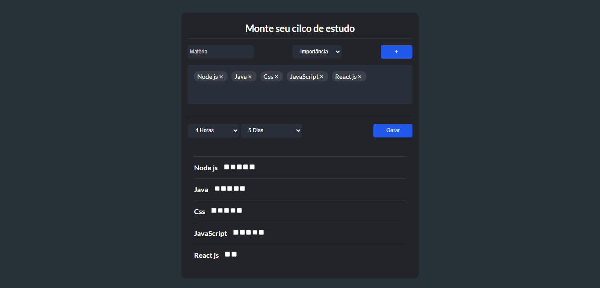

# Calculadora de Ciclo de Estudo
-  (EM DESEMVOLVIMENTO v- 1.0.1)

Bem-vindo à Calculadora de Ciclo de Estudo! Esta é uma aplicação em desenvolvimento criada para aprimorar habilidades em lógica de programação e front-end. O objetivo da aplicação é ajudar os usuários a planejar seus estudos, calculando o ciclo de estudo para cada matéria.

<a href="https://study-cycle-app.netlify.app">Link do site</a>

## Funcionalidades em Destaque

- **Calculadora de Ciclo:** Permite aos usuários inserir informações sobre as matérias que estão estudando, como quantidade de horas disponíveis por dia e número de dias de estudo por semana. Com base nesses dados, a aplicação calcula o ciclo de estudo recomendado para cada matéria.

- **Interface Amigável:** A interface da aplicação é projetada para ser intuitiva e fácil de usar. Os usuários podem adicionar, editar e remover matérias, além de visualizar os ciclos de estudo calculados de forma clara.

## Tecnologias Utilizadas

- **HTML, CSS e JavaScript:** A aplicação é construída com essas linguagens básicas da web, ajudando a aprimorar as habilidades de front-end.

- **Em Desenvolvimento:** A aplicação está em constante evolução, visando implementar novas funcionalidades e melhorar a experiência do usuário.

## Como Contribuir

Se você estiver interessado em contribuir para o desenvolvimento deste projeto:

1. Faça um fork deste repositório.

2. Crie uma nova branch com um nome descritivo para a funcionalidade que você está trabalhando.

3. Implemente suas alterações e adicione commits significativos.

4. Abra um Pull Request descrevendo as alterações que você fez.

5. Aguarde a revisão e o feedback da equipe de desenvolvimento.

## Estado Atual

A Calculadora de Ciclo de Estudo está em estágio de desenvolvimento inicial. Novas funcionalidades estão sendo adicionadas gradualmente para melhorar a experiência do usuário.
.

## Aviso Legal

Este projeto é criado apenas para fins de aprendizado e prática. Não tem intenção de ser usado em situações reais.

Agradecemos pelo interesse na Calculadora de Ciclo de Estudo!

---
